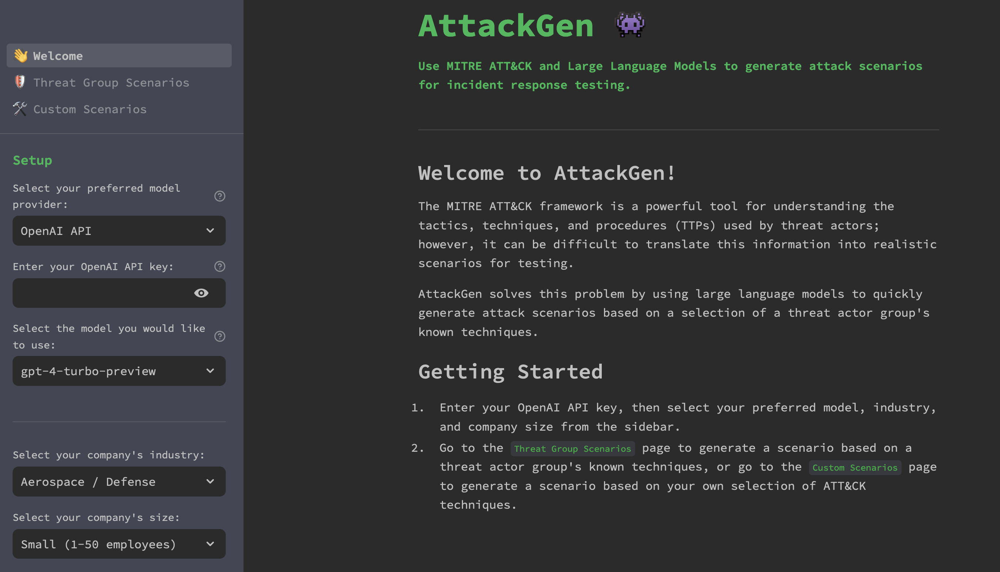

# AttackGen

AttackGen is a cybersecurity incident response testing tool that leverages the power of large language models and the comprehensive MITRE ATT&CK and ATLAS frameworks. The tool generates tailored incident response scenarios based on user-selected threat actor groups, AI attack case studies, and your organisation's details.

## Table of Contents
- [Star the Repo](#star-the-repo)
- [Features](#features)
- [Releases](#releases)
- [Requirements](#requirements)
- [Installation](#installation)
- [Data Setup](#data-setup)
- [Running AttackGen](#running-attackgen)
- [Usage](#usage)
- [Security Best Practices](#security-best-practices)
- [Contributing](#contributing)
- [Licence](#licence)

## Star the Repo
If you find AttackGen useful, please consider starring the repository on GitHub. This helps more people discover the tool. Your support is greatly appreciated! ⭐


## Features

- Generates unique incident response scenarios based on chosen threat actor groups or ATLAS case studies.
- Allows you to specify your organisation's size and industry for a tailored scenario.
- Supports MITRE ATT&CK Enterprise, ICS (Industrial Control Systems), and ATLAS (Adversarial Threat Landscape for AI Systems) frameworks.
- Displays a detailed list of techniques used by the selected threat actor group or case study.
- Create custom scenarios based on a selection of ATT&CK or ATLAS techniques.
- Use scenario templates to quickly generate custom scenarios based on common types of cyber incidents, including AI/ML-specific attack patterns.
- AttackGen Assistant - a chat interface for updating and/or asking questions about generated scenarios.
- Capture user feedback on the quality of the generated scenarios.
- Downloadable scenarios in Markdown format.
- Use the OpenAI API, Anthropic API (Claude models), Azure OpenAI Service, Google AI API, Mistral API, Groq API, locally hosted Ollama models, or custom OpenAI-compatible API endpoints to generate incident response scenarios.
- Available as a Docker container image for easy deployment.
- Optional integration with [LangSmith](https://docs.smith.langchain.com/) for powerful debugging, testing, and monitoring of model performance.
- Secure credential management using .env file for API keys and secrets.



## Releases

### v0.11
| What's new? | Why is it useful? |
| ----------- | ----------------- |
| MITRE ATLAS Framework Support | - AI/ML Threat Coverage: AttackGen now supports the MITRE ATLAS (Adversarial Threat Landscape for AI Systems) framework, enabling generation of incident response scenarios for threats targeting AI and machine learning systems.<br><br>- Case Study-Based Scenarios: Generate scenarios based on 45 documented real-world AI attack case studies, including 14 actual incidents and 31 research exercises covering attacks like prompt injection, model extraction, and data poisoning.<br><br>- 147 ATLAS Techniques: Access the full ATLAS technique library covering 16 AI-specific tactics including AI Model Access, AI Attack Staging, and traditional attack phases adapted for AI systems.<br><br>- AI-Specific Templates: Six new custom scenario templates for common AI/ML attacks: Model Evasion, Data Poisoning, Model Extraction, Prompt Injection, LLM Jailbreak, and AI Supply Chain attacks. |
| Updated MITRE ATT&CK Data to v18.1 | - Latest Threat Intelligence: AttackGen now uses MITRE ATT&CK v18.1 data, ensuring generated scenarios reflect the most current tactics, techniques, and procedures used by threat actors.<br><br>- Expanded Enterprise Coverage: The Enterprise threat groups list has grown from 150+ to 187 groups, including newly tracked actors.<br><br>- Expanded ICS Coverage: The ICS threat groups list has grown from 7 to 16 groups, providing better coverage for industrial control systems scenarios. |
| Updated LLM Model Support | - OpenAI: Added GPT-5.2 and GPT-5.2 Pro models; streamlined model list by removing deprecated o-series reasoning models.<br><br>- Anthropic: Updated to Claude 4.5 family with Sonnet 4.5, Haiku 4.5, and Opus 4.5.<br><br>- Google AI: Added Gemini 3 Pro and Flash preview models; updated Gemini 2.5 options.<br><br>- Groq: Added GPT-OSS 120B and 20B models for high-performance inference.<br><br>- Mistral: Updated to dated model versions (Large 2512, Medium 2508, Small 2506); added Ministral 14B. |
| Bug Fixes | - Fixed Google AI Response Handling: Updated response parsing to handle structured content format returned by newer Gemini models, ensuring scenario text is properly extracted and displayed.<br><br>- Fixed ICS Matrix Error Messages: Error messages now correctly display "ICS ATT&CK" instead of "Enterprise ATT&CK" when using the ICS matrix.<br><br>- Improved Empty Technique Handling: Added graceful handling when a threat group has no associated techniques, preventing secondary errors. |

### v0.10.1
| What's new? | Why is it useful? |
| ----------- | ----------------- |
| LangChain v1.0 Compatibility | - Fixed Breaking Import Changes: Updated all imports from deprecated `langchain.prompts.chat` to `langchain_core.prompts`, ensuring compatibility with LangChain v1.0 and preventing `ModuleNotFoundError` issues. This maintains stability as the LangChain ecosystem evolves. |
| Comprehensive Security Infrastructure | - Automated Security Scanning: Introduced GitHub Actions workflows for continuous security monitoring using Bandit (Python code analysis), CodeQL (vulnerability detection), pip-audit (dependency scanning), Safety (known vulnerabilities), Gitleaks (secrets detection), and Trivy (Docker image scanning).<br><br>- Security Best Practices Documentation: Added comprehensive SECURITY.md covering supported versions, vulnerability reporting, API key management, data privacy considerations, and deployment security guidance.<br><br>- Enhanced README Security Section: Expanded security guidance with clear do's and don'ts for API key protection, data privacy considerations, and responsible deployment practices. |
| Docker Improvements | - Enhanced Security: Updated Dockerfile to run as non-root user, improving container security posture.<br><br>- Docker Compose Support: Added docker-compose.yml for streamlined multi-service deployment and easier local development setup.<br><br>- Better Build Optimization: Enhanced .dockerignore to reduce image size and prevent sensitive files from being included in container images.<br><br>- Comprehensive Configuration Template: Updated .env.example with all supported API keys (OpenAI, Anthropic, Azure, Google, Mistral, Groq) for easier initial setup. |
| Bug Fixes | - Ollama API Timeout: Added timeout configuration to Ollama API requests to prevent hanging connections.<br><br>- Safety CLI Updates: Updated from deprecated `safety check` command to new `safety scan` command, ensuring continued security scanning functionality.<br><br>- Bandit Configuration: Corrected Bandit security scanning configuration for more accurate Python code analysis. |

### v0.10
| What's new? | Why is it useful? |
| ----------- | ----------------- |
| OpenAI Responses API Integration | - Next-Generation API: AttackGen now uses OpenAI's latest Responses API for all supported models, providing a unified and enhanced interface. |
| Latest Frontier Model Support | - GPT-5 Integration: Added support for OpenAI's latest GPT-5 model series including gpt-5, gpt-5-mini, and gpt-5-nano, providing access to the most advanced AI capabilities for scenario generation.<br><br>- Claude Sonnet 4.5: Added support for Anthropic's latest Claude Sonnet 4.5 (claude-sonnet-4-5-20250929) model, along with updated Claude model versions including Claude Opus 4.1 (claude-opus-4-1-20250805). |
| Bug Fixes and Improvements | - Fixed Streamlit Deprecation Warning: Replaced deprecated `use_container_width` parameter with the new `width` parameter to ensure compatibility with future Streamlit versions.<br><br>- Enhanced Documentation: Updated CLAUDE.md with comprehensive guidance for future development work and added detailed architecture information. |

### v0.9
| What's new? | Why is it useful? |
| ----------- | ----------------- |
| Expanded Model Support | - Latest OpenAI Reasoning Models: AttackGen now supports OpenAI's newest reasoning models including o4-mini (the latest reasoning model), o3/o3-mini, and o1-pro (enhanced reasoning capabilities). These models excel at complex scenario generation requiring deep logical thinking.<br><br>- GPT-4.1 Series: Added support for the GPT-4.1 series models (gpt-4.1, gpt-4.1-mini, and gpt-4.1-nano), offering the latest improvements in general AI capabilities with lighter alternatives for cost-sensitive use cases.<br><br>- Anthropic Claude Models: Added comprehensive support for Anthropic's Claude models including claude-opus-4-20250514, claude-sonnet-4-20250514, claude-3-7-sonnet-latest, and claude-3-5-haiku-latest. These models offer excellent performance for generating detailed and contextually aware incident response scenarios with strong reasoning capabilities.<br><br>- Updated Google AI Models: Refreshed the Google AI model selection to include the latest Gemini 2.5 preview models (gemini-2.5-flash-preview-05-20 and gemini-2.5-pro-preview-05-06) alongside Gemini 2.0 models, providing access to the most recent improvements in Google's AI technology.<br><br>- Improved Model Organization: Reorganized model selection dropdowns to prioritize newer models and updated descriptions to clearly distinguish between different model types and capabilities. |
| Enhanced Technique Selection Logic | - More Robust Group Handling: Fixed an issue where empty threat actor groups could cause errors during technique selection. The tool now properly handles empty groups by returning an empty DataFrame, ensuring stable operation even with limited threat actor data.<br><br>- Phase Name Preservation: Improved the technique selection process to properly include 'Phase Name' in the output, maintaining the kill chain phase information throughout the scenario generation process. This ensures generated scenarios maintain proper context about which phase of an attack each technique belongs to. |
| Development Environment Improvements | - Enhanced .gitignore: Added support for `.venv` virtual environment directories in addition to `venv`, accommodating different developer preferences and Python environment management tools.<br><br>- Code Cleanup: Removed unused imports across scenario generation scripts, improving code maintainability and reducing potential confusion. |

### v0.8
| What's new? | Why is it useful? |
| ----------- | ----------------- |
| Custom OpenAI-Compatible API Endpoints | - Increased Flexibility: AttackGen now supports custom OpenAI-compatible API endpoints like Anyscale, Together AI, or any self-hosted compatible API. This feature allows users to leverage a wider range of models and services beyond the officially supported providers.<br><br>- Self-Hosting Support: Organizations with their own deployments of OpenAI-compatible models can now connect AttackGen directly to these endpoints.<br><br>- Control Over Model Selection: Users can specify the base URL, model name, and API key for any compatible service, providing greater control over which models and endpoints are used for scenario generation. |
| Updated Model Selection | - Access to Latest Models: The OpenAI model selection now includes the new GPT-4.1 series models (gpt-4.1, gpt-4.1-mini, gpt-4.1-nano), offering improved performance in coding, instruction following, and long context tasks.<br><br>- Expanded Gemini Support: Added support for the latest Gemini 2.5 Pro Preview, 2.0 Flash, and 2.0 Flash Lite models. |

### v0.7
| What's new? | Why is it useful? |
| ----------- | ----------------- |
| Groq API Integration | - Enhanced Performance: AttackGen now supports Groq's high-performance API, providing access to models like llama-3.3-70b-versatile and deepseek-r1-distill-llama-70b. This integration offers fast inference times while maintaining high-quality scenario generation.<br><br>- Improved Model Output Display: For models like DeepSeek that provide reasoning alongside their output, AttackGen now displays this reasoning in a collapsible expander widget. This allows users to view the model's thought process when desired while keeping the main scenario output clean and focused. |
| Updated OpenAI Model Support | - Latest Models: AttackGen now supports OpenAI's latest o3 reasoning model and the GA (general availability) version of the o1 model, replacing the previous preview version. These updates provide access to more stable and improved models for scenario generation. |

<details>
  <summary>Click to view release notes for earlier versions.</summary>

### v0.6
| What's new? | Why is it useful? |
| ----------- | ----------------- |
| Support for OpenAI's new 'reasoning' models | - Enhanced Scenario Generation: AttackGen now supports OpenAI's new 'reasoning' models (o1-preview and o1-mini), enabling the generation of highly detailed and nuanced incident response scenarios. These models offer improved coherence and depth in scenario creation. |
| MITRE ATT&CK ICS matrix support | - Expanded Scope: AttackGen now supports generating incident response testing scenarios using the MITRE ATT&CK ICS (Industrial Control Systems) matrix, in addition to the Enterprise matrix. This allows users to create scenarios tailored to industrial and critical infrastructure environments. |
| Updated ATT&CK source data to v15.1 | - Latest Threat Intelligence: The tool now uses the most up-to-date MITRE ATT&CK data (v15.1), ensuring that generated scenarios reflect the latest known tactics, techniques, and procedures used by threat actors. |
| Updated threat actor groups data | - Comprehensive Coverage: The groups data has been updated to include the latest groups tracked in MITRE ATT&CK, such as Scattered Spider. This ensures that users can generate scenarios based on the most current threat actor information available. |
| Loading API keys / secrets from a .env file | - Enhanced Security: Users can now store their API keys and other sensitive information in a .env file, improving security and making it easier to manage credentials across different environments. |

### v0.5.2
| What's new? | Why is it useful? |
| ----------- | ---------------- |
| GPT-4o mini Model Support | - Expanded Model Options: AttackGen now supports the use of OpenAI's GPT-4o mini model. GPT4-o mini is a highly cost-efficient small model. |
| Updated model choices for Google AI API | - Expanded Model Options: AttackGen now supports the stable and preview versions of Gemini 1.5 Pro. | 

### v0.5.1
| What's new? | Why is it useful? |
| ----------- | ---------------- |
| GPT-4o Model Support | - Enhanced Model Options: AttackGen now supports the use of OpenAI's GPT-4o model. GPT4-o is OpenAI's leading model, able to generate scenarios twice as fast as GPT-4 for half the cost. |

### v0.5
| What's new? | Why is it useful? |
| ----------- | ---------------- |
| AttackGen Assistant | - Iterative Scenario Refinement: The new chat interface allows users to interact with their generated incident response scenarios, making it easy to update and ask questions about the scenario without having to regenerate it from scratch. This feature enables an iterative approach to scenario development, where users can refine and improve their scenarios based on the AI assistant's responses.<br><br>- Contextual Assistance: The AI assistant responds to user queries based on the context of the generated scenario and the conversation history. This ensures that the assistant's responses are relevant and helpful in refining the scenario. |
| Quick Start Templates for Custom Scenarios | - Quick Scenario Generation: Users can now quickly generate custom incident response scenarios based on predefined templates for common types of cyber incidents, such as phishing attacks, ransomware attacks, malware infections, and insider threats. This feature makes it easier to create realistic scenarios without having to select individual ATT&CK techniques.<br><br>- Streamlined Workflow: The template selection is integrated seamlessly into the custom scenario generation process. Users can choose a template, which automatically populates the relevant ATT&CK techniques, and then further customize the scenario if needed. |
| Google AI API Integration  | - Expanded Model Options: AttackGen now supports the use of Google's Gemini models for generating incident response scenarios. This integration expands the range of high-quality models available to users, allowing them to leverage Google's AI capabilities for creating realistic and diverse scenarios. |

### v0.4

| What's new? | Why is it useful? |
| ----------- | ---------------- |
| Mistral API Integration | - Alternative Model Provider: Users can now leverage the Mistral AI models to generate incident response scenarios. This integration provides an alternative to the OpenAI and Azure OpenAI Service models, allowing users to explore and compare the performance of different language models for their specific use case. |
| Local Model Support using Ollama | - Local Model Hosting: AttackGen now supports the use of locally hosted LLMs via an integration with Ollama. This feature is particularly useful for organisations with strict data privacy requirements or those who prefer to keep their data on-premises. Please note that this feature is not available for users of the AttackGen version hosted on Streamlit Community Cloud at https://attackgen.streamlit.app |
| Optional LangSmith Integration | - Improved Flexibility: The integration with LangSmith is now optional. If no LangChain API key is provided, users will see an informative message indicating that the run won't be logged by LangSmith, rather than an error being thrown. This change improves the overall user experience and allows users to continue using AttackGen without the need for LangSmith. |
| Various Bug Fixes and Improvements | - Enhanced User Experience: This release includes several bug fixes and improvements to the user interface, making AttackGen more user-friendly and robust. |

### v0.3

| What's new? | Why is it useful? |
| ----------- | ---------------- |
| Azure OpenAI Service Integration | - Enhanced Integration: Users can now choose to utilise OpenAI models deployed on the Azure OpenAI Service, in addition to the standard OpenAI API. This integration offers a seamless and secure solution for incorporating AttackGen into existing Azure ecosystems, leveraging established commercial and confidentiality agreements.<br><br>- Improved Data Security: Running AttackGen from Azure ensures that application descriptions and other data remain within the Azure environment, making it ideal for organizations that handle sensitive data in their threat models. |
| LangSmith for Azure OpenAI Service | - Enhanced Debugging: LangSmith tracing is now available for scenarios generated using the Azure OpenAI Service. This feature provides a powerful tool for debugging, testing, and monitoring of model performance, allowing users to gain insights into the model's decision-making process and identify potential issues with the generated scenarios.<br><br>- User Feedback: LangSmith also captures user feedback on the quality of scenarios generated using the Azure OpenAI Service, providing valuable insights into model performance and user satisfaction. |
| Model Selection for OpenAI API | - Flexible Model Options: Users can now select from several models available from the OpenAI API endpoint, such as `gpt-4-turbo-preview`. This allows for greater customization and experimentation with different language models, enabling users to find the most suitable model for their specific use case. |
| Docker Container Image | - Easy Deployment: AttackGen is now available as a Docker container image, making it easier to deploy and run the application in a consistent and reproducible environment. This feature is particularly useful for users who want to run AttackGen in a containerised environment, or for those who want to deploy the application on a cloud platform. |


### v0.2

| What's new? | Why is it useful? |
| ----------- | ---------------- |
| Custom Scenarios based on ATT&CK Techniques | - For Mature Organisations: This feature is particularly beneficial if your organisation has advanced threat intelligence capabilities. For instance, if you're monitoring a newly identified or lesser-known threat actor group, you can tailor incident response testing scenarios specific to the techniques used by that group.<br><br>- Focused Testing: Alternatively, use this feature to focus your incident response testing on specific parts of the cyber kill chain or certain MITRE ATT&CK Tactics like 'Lateral Movement' or 'Exfiltration'. This is useful for organisations looking to evaluate and improve specific areas of their defence posture. |
| User feedback on generated scenarios | - Collecting feedback is essential to track model performance over time and helps to highlight strengths and weaknesses in scenario generation tasks. |
| Improved error handling for missing API keys | - Improved user experience. |
| Replaced Streamlit `st.spinner` widgets with new `st.status` widget | - Provides better visibility into long running processes (i.e. scenario generation). |

### v0.1

Initial release.

</details>

## Requirements

- Recent version of Python.
- Python packages: pandas, streamlit, and any other packages necessary for the custom libraries (`langchain` and `mitreattack`).
- OpenAI API key (or API key for your chosen model provider).
- LangChain API key (optional) - see [LangSmith Setup](#langsmith-setup) section below for further details.
- Data files: `enterprise-attack.json` and `ics-attack.json` (MITRE ATT&CK datasets in STIX format), and `groups.json`.
- `.env` file for storing API keys and secrets (see [Installation](#installation) section for details).

## Installation

### Option 1: Cloning the Repository

1. Clone this repository:
```
git clone https://github.com/mrwadams/attackgen.git
```

2. Change directory into the cloned repository:

```
cd attackgen
```

3. Install the required Python packages:

```
pip install -r requirements.txt
```

### Option 2: Using Docker

1. Pull the Docker container image from Docker Hub:

```
docker pull mrwadams/attackgen
```

## LangSmith Setup

If you would like to use LangSmith for debugging, testing, and monitoring of model performance, you will need to set up a LangSmith account and create a `.streamlit/secrets.toml` file that contains your LangChain API key. Please follow the instructions [here](https://docs.smith.langchain.com/) to set up your account and obtain your API key. You'll find a `secrets.toml-example` file in the `.streamlit/` directory that you can use as a template for your own secrets.toml file.

If you do not wish to use LangSmith, you must still have a `.streamlit/secrets.toml` file in place, but you can leave the `LANGCHAIN_API_KEY` field empty.

## Data Setup

Download the latest version of the MITRE ATT&CK dataset in STIX format from [here](https://github.com/mitre-attack/attack-stix-data/blob/master/enterprise-attack/enterprise-attack.json). Ensure to place this file in the `./data/` directory within the repository.

## Running AttackGen

After the data setup, you can run AttackGen with the following command:

```
streamlit run 00_👋_Welcome.py
```

You can also try the app on [Streamlit Community Cloud](https://attackgen.streamlit.app/).

## Usage

### Running AttackGen

#### Option 1: Running the Streamlit App Locally
1. Run the Streamlit app:
```
streamlit run 00_👋_Welcome.py
```
2. Open your web browser and navigate to the URL provided by Streamlit.
3. Use the app to generate standard or custom incident response scenarios (see below for details).

#### Option 2: Using the Docker Container Image
1. Run the Docker container:
```
docker run -p 8501:8501 mrwadams/attackgen
```
This command will start the container and map port 8501 (default for Streamlit apps) from the container to your host machine.
2. Open your web browser and navigate to `http://localhost:8501`.
3. Use the app to generate standard or custom incident response scenarios (see below for details).

### Generating Scenarios

#### Standard Scenario Generation
1. Choose whether to use the OpenAI API, Azure OpenAI Service, Google AI API, Mistral API, Groq API, or locally hosted Ollama models.
2. Enter your API key for the chosen model provider, or the API key and deployment details for your model on the Azure OpenAI Service.
3. Select your preferred model from the dropdown.
4. Select your organisation's industry and size from the dropdown menus.
5. Navigate to the `Threat Group Scenarios` page.
6. Select the Threat Actor Group that you want to simulate.
7. Click on 'Generate Scenario' to create the incident response scenario.
8. Use the 👍 or 👎 buttons to provide feedback on the quality of the generated scenario. N.B. The feedback buttons only appear if a value for LANGCHAIN_API_KEY has been set in the `.streamlit/secrets.toml` file.

#### Custom Scenario Generation
1. Choose whether to use the OpenAI API, Azure OpenAI Service, Google AI API, Mistral API, Groq API, or locally hosted Ollama models.
2. Enter your API key for the chosen model provider, or the API key and deployment details for your model on the Azure OpenAI Service.
3. Select your preferred model from the dropdown.
4. Select your organisation's industry and size from the dropdown menus.
5. Navigate to the `Custom Scenario` page.
6. Use the multi-select box to search for and select the ATT&CK techniques relevant to your scenario.
7. Click 'Generate Scenario' to create your custom incident response testing scenario based on the selected techniques.
8. Use the 👍 or 👎 buttons to provide feedback on the quality of the generated scenario. N.B. The feedback buttons only appear if a value for LANGCHAIN_API_KEY has been set in the `.streamlit/secrets.toml` file.

Please note that generating scenarios may take a minute or so. Once the scenario is generated, you can view it on the app and also download it as a Markdown file.

## Security Best Practices

AttackGen is designed for local, single-user deployment. When using the tool:

### Protecting Your API Keys

**Your API keys are sensitive credentials that can incur charges on your account.**

✅ **DO:**
- Enter API keys through the UI (they stay in your browser session)
- Use .env file for convenience on your personal machine
- Set spending limits in your LLM provider dashboard
- Regularly review your API usage and costs
- Clear session when using on shared computers

❌ **DON'T:**
- Commit .env files to version control (already in .gitignore)
- Share screenshots with API keys visible
- Run AttackGen on untrusted/compromised systems
- Share your API keys with others
- Ignore unexpected API charges

### Data Privacy Considerations

When you generate scenarios, AttackGen sends data to your chosen LLM provider:
- Organization details (industry, company size)
- Selected ATT&CK techniques
- Custom input text
- Generated scenarios (via AttackGen Assistant)

**What this means:**
- OpenAI, Anthropic, etc. may log this data per their privacy policies
- Consider using generic/fictional organization details for demonstrations
- Review your LLM provider's data retention and privacy policies
- For sensitive use cases, consider providers with stricter privacy guarantees

### For Team/Organization Deployments

If deploying AttackGen for multiple users (not the default use case):
- Add authentication/authorization (not included by default)
- Use a secrets management service for API keys
- Deploy behind VPN or internal network
- Review this threat model document for additional considerations
- Consider data residency and compliance requirements

### Dependency Security

We maintain dependencies and monitor for vulnerabilities:
- Dependencies are updated regularly
- Security advisories are tracked in GitHub Issues
- Run `pip list --outdated` to check for updates
- Consider using `pip-audit` for vulnerability scanning

### Reporting Security Issues

Found a security issue? Please report it responsibly:
- Create a security advisory via GitHub's [private vulnerability reporting](https://github.com/mrwadams/attackgen/security/advisories/new)
- Don't post security issues publicly
- We'll acknowledge within 48 hours
- Fixes will be prioritized and released quickly

## Contributing

I'm very happy to accept contributions to this project. Please feel free to submit an issue or pull request.

## Licence

This project is licensed under [GNU GPLv3](https://choosealicense.com/licenses/gpl-3.0/).