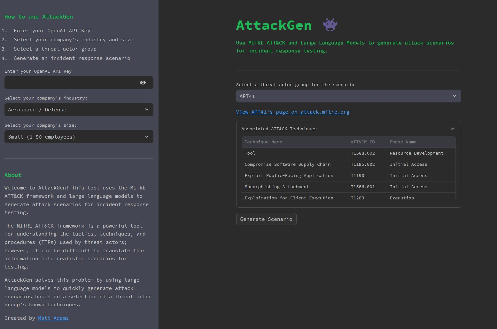

# AttackGen

AttackGen is a cybersecurity incident response testing tool that leverages the power of large language models and the comprehensive MITRE ATT&CK framework. The tool generates tailored incident response scenarios based on user-selected threat actor groups and your organisation's details.

## Table of Contents
- [Star the Repo](#star-the-repo)
- [Features](#features)
- [Releases](#releases)
- [Requirements](#requirements)
- [Installation](#installation)
- [Data Setup](#data-setup)
- [Running AttackGen](#running-attackgen)
- [Usage](#usage)
- [Contributing](#contributing)
- [Licence](#licence)

## Star the Repo
If you find AttackGen useful, please consider starring the repository on GitHub. This helps more people discover the tool. Your support is greatly appreciated! ⭐


## Features

- Generates unique incident response scenarios based on chosen threat actor groups.
- Allows you to specify your organisation's size and industry for a tailored scenario.
- Displays a detailed list of techniques used by the selected threat actor group as per the MITRE ATT&CK framework.
- 🆕 Create custom scenarios based on a selection of ATT&CK techniques.
- 🆕 Capture user feedback on the quality of the generated scenarios.
- Downloadable scenarios in Markdown format.
- Integrated with [LangSmith](https://docs.smith.langchain.com/) for powerful debugging, testing, and monitoring of model performance.



## Releases
### v0.2 (current)

| What's new? | Why is it useful? |
| ----------- | ---------------- |
| Custom Scenarios based on ATT&CK Techniques | - For Mature Organisations: This feature is particularly beneficial if your organisation has advanced threat intelligence capabilities. For instance, if you're monitoring a newly identified or lesser-known threat actor group, you can tailor incident response testing scenarios specific to the techniques used by that group.<br><br>- Focused Testing: Alternatively, use this feature to focus your incident response testing on specific parts of the cyber kill chain or certain MITRE ATT&CK Tactics like 'Lateral Movement' or 'Exfiltration'. This is useful for organisations looking to evaluate and improve specific areas of their defence posture. |
| User feedback on generated scenarios | - Collecting feedback is essential to track model performance over time and helps to highlight strengths and weaknesses in scenario generation tasks. |
| Improved error handling for missing API keys | - Improved user experience. |
| Replaced Streamlit `st.spinner` widgets with new `st.status` widget | - Provides better visibility into long running processes (i.e. scenario generation). |

### v0.1

Initial release.

## Requirements

- Recent version of Python.
- Python packages: pandas, streamlit, and any other packages necessary for the custom libraries (`langchain` and `mitreattack`).
- OpenAI API key.
- LangChain API key (optional) - see [LangSmith Setup](#langsmith-setup) section below for further details.
- Data files: `enterprise-attack.json` (MITRE ATT&CK dataset in STIX format) and `groups.json`.

## Installation

1. Clone the repository:

```
git clone https://github.com/mrwadams/attackgen.git
```

2. Change directory into the cloned repository:

```
cd attackgen
```

3. Install the required Python packages:

```
pip install -r requirements.txt
```

## LangSmith Setup

If you would like to use LangSmith for debugging, testing, and monitoring of model performance, you will need to set up a LangSmith account and create a `.streamlit/secrets.toml` file that contains your LangChain API key. Please follow the instructions [here](https://docs.smith.langchain.com/) to set up your account and obtain your API key. You'll find a secrets.toml-example file in the `.streamlit/` directory that you can use as a template for your own secrets.toml file.

If you do not wish to use LangSmith, you can delete the LangSmith related environment variables from the top of the following files:
- `pages/1_🛡️_Threat_Group_Scenarios.py`
- `pages/2_🛠️_Custom_Scenarios.py`

## Data Setup

Download the latest version of the MITRE ATT&CK dataset in STIX format from [here](https://github.com/mitre-attack/attack-stix-data/blob/master/enterprise-attack/enterprise-attack.json). Ensure to place this file in the `./data/` directory within the repository.

## Running AttackGen

After the data setup, you can run AttackGen with the following command:

```
streamlit run 👋_Welcome.py
```

You can also try the app on [Streamlit Community Cloud](https://attackgen.streamlit.app/).

## Usage

### Standard Scenario Generation
1. Enter your OpenAI API Key.
2. Select your organisation's industry and size from the dropdown menus.
3. Navigate to the `Threat Group Scenarios` page.
4. Select the Threat Actor Group that you want to simulate.
5. Click on 'Generate Scenario' to create the incident response scenario.
6. Use the 👍 or 👎 buttons to provide feedback on the quality of the generated scenario.

### 🆕 Custom Scenario Generation
1. Enter your OpenAI API Key.
2. Select your organisation's industry and size from the dropdown menus.
3. Navigate to the `Custom Scenario` page.
4. Use the multi-select box to search for and select the ATT&CK techniques relevant to your scenario.
5. Click 'Generate Scenario' to create your custom incident response testing scenario based on the selected techniques.
6. Use the 👍 or 👎 buttons to provide feedback on the quality of the generated scenario.

Please note that generating scenarios may take a minute or so. Once the scenario is generated, you can view it on the app and also download it as a Markdown file.

## Contributing

I'm very happy to accept contributions to this project. Please feel free to submit an issue or pull request.

## Licence

This project is licensed under [GNU GPLv3](https://choosealicense.com/licenses/gpl-3.0/).
